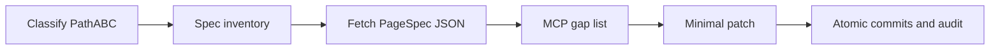

# playbook-builder

AI Guild tooling: agents, rules, and skills to prototype UIs from Figma using Playbook components. Consumes Playbook; not maintained by the Playbook design system team.

## Why this exists

The Figma MCP's `get_metadata` returns a sparse XML tree with no text content,
colors, spacing, or component props. The `get_design_context` compensates by
generating thousands of lines of Tailwind code, prop type definitions, and
system instructions -- most of which is noise.

This tool calls the **Figma REST API directly** (`GET /v1/files/:key/nodes`),
which returns the full node tree as JSON in a single request: text content,
auto-layout properties, fills, strokes, font info, and component references.

It then compresses that into a compact `PageSpec` JSON with:
- Actual text content on every node
- Playbook component names matched by Figma instance names
- Spacing tokens (not raw pixels)
- Layout orientation, gap, alignment, and padding

## Installation

In a consuming repo (e.g., nitro-web):

```bash
# Add to .npmrc in your project
@powerhome:registry=https://npm.pkg.github.com

# Install
npm install @powerhome/playbook-builder
```

Requires a GitHub PAT with `read:packages` scope in your user-level `~/.npmrc`:

```
//npm.pkg.github.com/:_authToken=YOUR_TOKEN
```

## Consuming these skills from nitro-web

Agents ship UI in **nitro-web** (or another Nitro app), not in this repo alone.

- **Spec fetch:** Install `@powerhome/playbook-builder` in the consuming repo (see above) and set `FIGMA_TOKEN` when fetching specs. Agents may run it via shell (`npx` / `playbook-builder`) or via a **plugin / marketplace** integration (for example nitro-web or plugin-config) that wraps the same package — the requirement is valid PageSpec JSON, not a particular terminal command.
- **Cursor skills:** Copy or symlink [`.cursor/skills/figma-build/`](.cursor/skills/figma-build/) into nitro-web as `.cursor/skills/figma-build/`, or keep this repo cloned and point Cursor at that skill path so [SKILL.md](.cursor/skills/figma-build/SKILL.md) loads.
- **Workflow vs rules:** Nitro `.cursor/rules` (Playbook, frontend) enforce tokens and components; figma-build skills define **process** (Path A/C, deltas, MCP, commits). Do not duplicate styling policy here.
- **Where to start:** Path A vs Path C from SKILL.md; incremental edits use [extend-existing-page.md](.cursor/skills/figma-build/references/extend-existing-page.md). Optionally summarize both links from nitro-web `AGENTS.md`.

## Design-to-code pipeline (agents)

Spine for turning Figma into nitro-web UI:



Choose Path A, B, or C → list planned `node-id`s (or skip rationale) → run `playbook-builder` (shell or plugin) → MCP gap check → smallest code patch → one commit per logical step → scoped post-build audits.

## Development setup

```bash
# 1. Get a Figma personal access token
#    Go to: https://www.figma.com/developers → Personal access tokens
#    Create a token with file_content:read scope

# 2. Export it (add to your shell profile for persistence)
export FIGMA_TOKEN="figd_<your_personal_access_token>"
```

When developing from a git clone, the wrapper can run `npm install` and `npm run build` on first use if `dist/` is missing or stale.

### Test the TypeScript build

```bash
npm install && npm run build
```

### Test the npm package (no Figma API)

Simulates installing from a registry tarball and checks that the CLI runs from `node_modules/.bin`:

```bash
npm run test:package
```

### Test against Figma (integration)

With `FIGMA_TOKEN` set, run `playbook-builder` with a real design URL:

```bash
playbook-builder --url "https://www.figma.com/design/abc123/MyFile?node-id=358-93336" > spec.json
```

## Usage

Output is written to stdout. Redirect to save to a file:

```bash
# Produce a compact page spec
playbook-builder --url "https://www.figma.com/design/abc123/MyFile?node-id=358-93336" > spec.json

# Output raw REST API JSON (for inspection / debugging)
playbook-builder --url "https://..." --raw > raw.json

# Pipe to jq for inspection
playbook-builder --url "https://..." | jq '.layout.children[0]'

# Limit traversal depth
playbook-builder --url "https://..." --depth 5 > spec.json
```

### Multiple selections and comparison bundles

For add/edit work, fetch the small **delta** node plus a wider **context** node
when placement matters. The CLI batches those selections in one Figma API
request and writes a `PageSpecBundle`:

```bash
playbook-builder \
  --selection delta "https://www.figma.com/design/abc123/MyFile?node-id=555-666" \
  --selection context "https://www.figma.com/design/abc123/MyFile?node-id=111-222" \
  > bundle.json
```

The bundle contains one spec per selection and, when `delta` and `context` are
present, a `comparison` object with the delta's path and sibling position inside
the context tree. Use the delta spec for codegen; use the comparison as a
placement hint before reconciling with the existing nitro-web files.

For implementation in **nitro-web**, incremental UI changes follow Path C and **Spec inventory and atomic commits** in [extend-existing-page.md](.cursor/skills/figma-build/references/extend-existing-page.md); greenfield page builds follow Path A Step 6 / Step 8 commit checkpoints and **Incremental delivery and git commits** in [SKILL.md](.cursor/skills/figma-build/SKILL.md).

### Handing off add/edit work to an agent

For nitro-web work that changes UI which already exists, do not treat the full
page design as a greenfield build. Agents should follow **Path C** in
[SKILL.md](.cursor/skills/figma-build/SKILL.md), then use the add/edit workflow and templates in
[extend-existing-page.md](.cursor/skills/figma-build/references/extend-existing-page.md).

Good handoffs include:

- The app page, menu path, route, component pack, or feature name where the
  change belongs
- A Figma `node-id` for the smallest frame that contains only the new or changed
  UI
- Whether the change is `add_page_section`, `add_inside_feature`,
  `edit_page_section`, `edit_feature`, or `interaction_only`
- What should remain untouched, especially existing feature wiring, callbacks,
  data flow, and page sections
- Interaction notes when behavior matters: states, triggers, persistence, and
  any existing API/callback to reuse

Agents should reconcile the scoped Figma spec into the existing nitro-web code
structure rather than mirroring Figma layer names or regenerating unrelated
sections. Record planned spec scope up front and land **small, reviewable
commits** so reviewers can follow progress; see **Spec inventory and atomic
commits** in
[extend-existing-page.md](.cursor/skills/figma-build/references/extend-existing-page.md).

## Flags

| Flag              | Required | Description                                         |
|-------------------|----------|-----------------------------------------------------|
| `--url`           | Yes      | Figma design URL with `node-id` query param         |
| `--selection`     | No       | Role + Figma URL; repeat for comparison bundles     |
| `--target`        | No       | `react` (default) or `rails`                        |
| `--raw`           | No       | Output the raw Figma REST API JSON                  |
| `--no-optimize`   | No       | Skip chrome removal and node flattening              |
| `--depth`         | No       | Limit API traversal depth (default: full tree)       |

## Environment

| Variable      | Required | Description                          |
|---------------|----------|--------------------------------------|
| `FIGMA_TOKEN` | Yes      | Figma personal access token          |

## Output format

```json
{
  "target": "react",
  "layout": {
    "component": "Flex",
    "props": { "orientation": "column", "gap": "sm" },
    "children": [
      {
        "component": "Title",
        "props": { "size": 4, "bold": true },
        "text": "Project Summary"
      },
      {
        "component": "Caption",
        "props": { "color": "light", "size": "xs" },
        "text": "Project Number"
      },
      {
        "component": "Body",
        "props": { "color": "link" },
        "text": "38-67893"
      }
    ]
  }
}
```

## How it maps Figma → Playbook

| Figma node type | Detection                        | Playbook component          |
|-----------------|----------------------------------|-----------------------------|
| TEXT            | fontSize >= 20 + bold            | Title (size 3)              |
| TEXT            | fontSize >= 14 + bold            | Title (size 4)              |
| TEXT            | fontSize <= 12                   | Caption                     |
| TEXT            | fontSize < 14 + bold             | Detail                      |
| TEXT            | default                          | Body                        |
| INSTANCE        | name matches Playbook component  | That component              |
| FRAME           | auto-layout + card styling       | Card                        |
| FRAME           | auto-layout                      | Flex                        |
| FRAME           | static + card styling            | Card                        |
| FRAME           | generic container                | _Frame (informational)      |

## Optimization

By default, the output is optimized to remove noise:

1. **Chrome removal** — strips the NitroHeader, sidebar nav, and top bar
   (detected by known nav item labels and structural patterns)
2. **Node flattening** — collapses single-child Flex wrappers, removes
   empty `_Frame` nodes, and merges redundant nested Flex containers

On the Accounting Review page this reduces output from **5,900 → ~1,000 lines**
and **701 → 156 components** while preserving all 79 page text nodes.

Use `--no-optimize` to get the unfiltered output for debugging.

## Comparison with MCP workflow

| Aspect              | MCP workflow           | playbook-builder          |
|---------------------|------------------------|---------------------------|
| API calls           | 3-5 (screenshot +      | 1 (REST API)              |
|                     | metadata + design      | + 1 optional screenshot   |
|                     | context x N sub-nodes) |                           |
| Text content        | Read from screenshot   | Direct from JSON          |
| Spacing             | Inferred from Tailwind | Computed from px → tokens |
| Output size         | Thousands of lines     | ~200-1000 lines JSON      |
| Component matching  | Code Connect snippets  | Name-based matching       |
